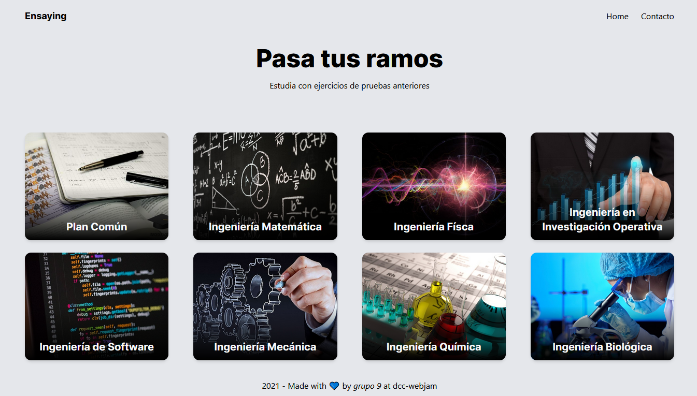

  <h1>🌎 CCC WebJam 21-I</h1>

  <a href="https://github.com/benjavicente/webjam-2021-2#-project">Project</a> ·
  <a href="https://github.com/benjavicente/webjam-2021-2#-submission">Submission</a> ·
  <a href="https://github.com/benjavicente/webjam-2021-2#%EF%B8%8F-images">Images</a> ·
  <a href="https://github.com/benjavicente/webjam-2021-2#-team">Team</a> ·
  <a href="https://github.com/benjavicente/webjam-2021-2#%EF%B8%8F-technologies">Technologies</a> ·
  <a href="https://github.com/benjavicente/webjam-2021-2#-comments">Comments</a>

  
  
  
  

## 🎨 Project

**Project 9**

> Repositorio con pruebas y ejercicios de años anteriores dentro del plan común de la Ingeniería, así como programación.
> Los alumnos pueden ejercitar utilizando el material en esta plataforma de aspecto amigable.

## 🎒 Submission

* [ ] [Website URL](https://www.ensaying.tk/)
* [ ] [Source Code URL](https://github.com/benjavicente/webjam-2021-2.git)

## 🖼️ Images

  

## 👪 Team

||Name|University|Username|Feature
|-|-|-|-|-
|#1|Diego Valenzuela|Pontificia Universidad Católica de Chile|[@ideadiego](https://github.com/ideadiego)|Feature
|#2|Benjamín Vicente|Pontificia Universidad Católica de Chile|[@benjavicente](https://github.com/benjavicente)|Feature
|#3|María Ramírez|Universidad Técnica Federico Santa María|[@dima-RE](https://github.com/dima-RE)|Feature

## 🏗️ Technologies

* **Feature:**
  * [Next.js](https://nextjs.org/) - Framework JS de React que trabaja con librerías JavaScript y TypeScript.
  * [Tailwindcss](https://tailwindcss.com/) - Framework CSS con una sintaxis más flexible.
  * [Google Drive API](https://developers.google.com/drive/api/) - API de Google Drive para acceder a carpetas compartidas.

## 💬 Comments

> Please provide additional comments of your project here.